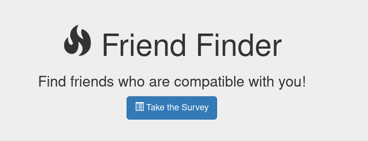

# FriendFinder
## FriendFinder is a compatability app
It will take the results of a survey and return the name of the most compatible friend, along with a link to an image of themselves they provide. The survey consists of 10 questions whose answers are ranked from 1-5. The absolute value of the difference between responders' answers is found and returned to calculate a sense of overall compatability. 
* From the home page, follow the link to the survey:

* Take the survey and submit results. A compatible friend will be returned!
* Close the modal that appears and you will be redirected to the home page, from where you can view the FriendFinder API. This will include everyone's information, including yours!
* Follow link to see the deployed project on heroku: https://friend-finder-bo.herokuapp.com/
